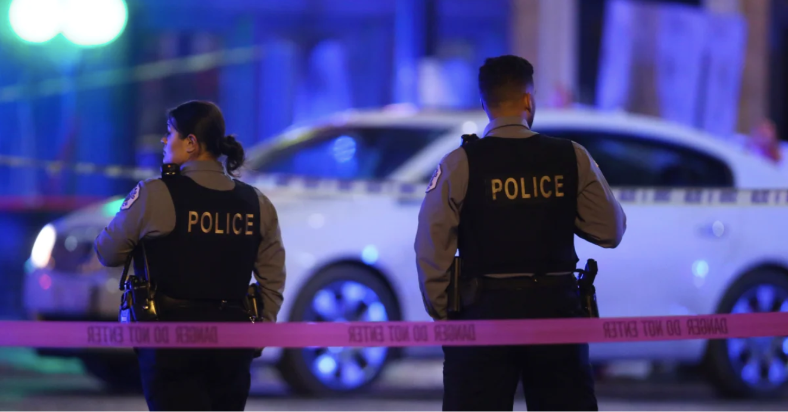

&nbsp;
&nbsp;

# Exploring and Analysing gun violence and mass shooting in the U.S. and New York
Jie Liu, Xiaoluo Jiao, Ziqian He, Yu Si, Xinyuan Liu, Tianchuan Gao

*"2020 is an unusual and turbulent year during which the world has struggled with a pandemic for a long time. Since January 15 2020 in which  the first case of Covid-19 appeared in the United States, the epidemic has lasted 22 months and when it will end still remains uncertain. Under the influence of it, people’s lifestyle, mental health and some economic indicators like GDP, unemployment rate fluctuate dramatically in America."*

*Image and quote from [_TIME_: "We're Catching It Double."](https://time.com/5818553/gun-violence-chicago-coronavirus/)*

*Police work a crime scene in Chicago on Nov. 19, 2019. Despite a statewide shelter-in-place order in an attempt to stop the spread of the coronavirus, the city is still facing high levels of gun violence. *

 
 <iframe width="650" height="410"
  src="https://www.youtube.com/embed/9glfCfrTv-E" 
 frameborder="0" allow="accelerometer; autoplay; clipboard-write; encrypted-media; gyroscope; picture-in-picture" allowfullscreen></iframe> 
 

 
 
 
 
 
 
 
 
 
 
 
 
 
 

